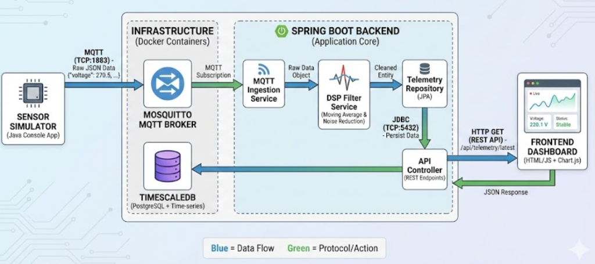

# Telemetry Engine ⚡📊

A lightweight **Spring Boot telemetry ingestion system** that consumes real-time sensor data over **MQTT**, processes it, and stores it in **TimescaleDB** for visualization and analysis using **Grafana**.
Note- The Sensor part is present in another repository - https://github.com/atulsingh1704/sensor-emulator
The repository also includes:
- An **Eclipse Mosquitto** broker
- A **sensor emulator** for local testing and load simulation
- A **Grafana dashboard** for multi-sensor monitoring

This project demonstrates **backend engineering, distributed systems, containerization, and observability**.

To be noted this is the backend part i have created a project sensor emulator to create a fake sensor and its docker file i have made a i mage and commands mentioned run 5 containers of that emulator making 5 sensors . The backend is build to manage 5000 devices hitting every sec.

---

## 🚀 Features

- 📡 **MQTT-based ingestion** using Mosquitto as it is used in IoT devices
- 🧠 **Spring Boot backend** for telemetry processing and using available Spring Boot librarires for Mqtt communication.
- 🗄 **TimescaleDB (PostgreSQL)** for time-series storage 
- 📊 **Grafana dashboards** with multi-sensor filtering
- 🔁 **Dockerized sensor emulator** for realistic testing
- 🐳 Fully containerized with **Docker & Docker Compose**

---
## Overview of how the project works 
Size of the video is big so to see the project download the video althought it shows how grafana is being utilized and the backend working. 

## 🏗 Architecture Overview


---

## 📁 Repository Contents

- `Dockerfile` — multi-stage build for the Spring Boot application
- `docker-compose.yml` — services:
  - Mosquitto (MQTT broker)
  - TimescaleDB (PostgreSQL)
  - Grafana
  - Telemetry Engine (Spring Boot)
- `mosquitto/`
  - `config/` — broker configuration
  - `data/`, `log/`
- `sensor-emulator/` — Dockerized Java-based sensor simulator
- `src/` — Spring Boot source code

---

## 🔧 Prerequisites

- **Docker Engine** & **Docker Compose** (recommended)
- OR **Java 17+ & Maven** (for local builds)
- (Optional) Docker Hub account for pushing images

---

## 🧪 Sensor Emulator

The sensor emulator simulates multiple electrical sensors and publishes telemetry to MQTT topics:  
`energy/sensor/{sensor_id}`

### Environment Variables

| Variable | Description | Example |
| :--- | :--- | :--- |
| `SENSOR_ID` | Unique sensor identifier | `device-001` |
| `INTERVAL_MS` (optional) | Publish interval | `1000` |

### Run a Sensor (Docker)

```bash
docker run -d \
  --network=host \
  -e SENSOR_ID=device-001 \
  sensor-emulator:slim
```

### Run Multiple Sensors (Docker Compose)

```bash
docker compose up -d
```

---

## 🏗 Build (Local)

From the project root:

```bash
# build with Maven
./mvnw clean package -DskipTests

# run locally
java -jar target/telemetry-engine-0.0.1-SNAPSHOT.jar
```

---

## 🐳 Build Docker Image

The project uses a multi-stage Dockerfile:
1. **Build stage** → Maven
2. **Runtime stage** → slim JRE

```bash
# build image
docker build -t atulsingh17/telemetry-engine:latest .

# test run
docker run --rm -p 8080:8080 atulsingh17/telemetry-engine:latest
```

### Push to Docker Hub (Optional)

```bash
docker login
docker push atulsingh17/telemetry-engine:latest
```

---

## ▶️ Using Docker Compose

The included `docker-compose.yml` starts all required services together.

```bash
# build and start
docker-compose up --build

# run in background
docker-compose up --build -d

# stop and remove
docker-compose down

# view logs
docker-compose logs -f telemetry-app
```

---

## 🗄 Database (TimescaleDB)

**Database Name:** `smartgrid`

### Telemetry Table (Example)

```sql
CREATE TABLE telemetry (
  timestamp   TIMESTAMPTZ NOT NULL,
  sensor_id   TEXT NOT NULL,
  voltage     DOUBLE PRECISION,
  current     DOUBLE PRECISION,
  temperature DOUBLE PRECISION
);
```

### Convert to Hypertable

```sql
SELECT create_hypertable('telemetry', 'timestamp', if_not_exists => TRUE);
```

---

## 📊 Grafana Dashboard

### Dashboard Variable (Multi-Sensor)
- **Query:** `SELECT DISTINCT sensor_id FROM telemetry ORDER BY sensor_id;`
- **Multi-value:** ✅
- **Include All:** ✅
- **All value:** `.*`

### Example Query (Voltage – Multi Sensor)

```sql
SELECT
  timestamp AS "time",
  voltage,
  sensor_id
FROM telemetry
WHERE
  $__timeFilter(timestamp)
  AND sensor_id ~ '(${sensor_id:regex})'
ORDER BY timestamp ASC;
```

### Panels Included
- 📈 **Voltage per sensor** (time series)
- 🌡 **Temperature per sensor** (time series)
- 🔢 **Latest voltage & temperature** (stat panels)
- 📋 **Latest reading per sensor** (table)
- ⚠️ **Voltage spike detection**

---

## 🔌 Ports

| Service | Port |
| :--- | :--- |
| Spring Boot App | `8080` |
| Mosquitto (MQTT) | `1883` |
| Mosquitto (WebSocket) | `9001` |
| TimescaleDB | `5432` |
| Grafana | `3000` |

---

## 🛠 Troubleshooting

If docker build fails, try pulling base images manually:

```bash
docker pull maven:3.9.4-openjdk-17
docker pull eclipse-temurin:17-jre
```

If services are slow to start, check logs:

```bash
docker-compose logs
```

---

## 🔁 CI/CD Notes

Recommended pipeline:
1. Build Maven artifact
2. Build Docker image
3. Tag with version / commit SHA
4. Push to Docker Hub
5. Deploy via:

```bash
docker-compose pull
docker-compose up -d
```

---

## 🧠 Key Concepts Demonstrated

- MQTT-based telemetry ingestion
- Time-series data modeling
- Dockerized microservices
- Observability with Grafana
- Scalable sensor simulation
- Backend system design

---

## 👤 Author

**Atul Singh** *Backend / Systems Engineering* Java · Spring Boot · Docker · Time-Series Databases

---

## 📄 License

This project is provided as-is.  
*Add a license file if you plan to release it publicly.*
